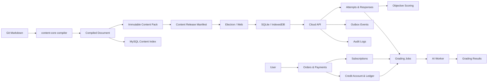

# TOEFL AI 批改平台数据库设计

> **版本：v2.0（Enterprise-ready）**  
> **基于仓库：`anton-bis/toefl-app` v1.5.2 ZIP**  
> **数据库：云端 MySQL 8.0 + 客户端 SQLite / IndexedDB**  
> **日期：2026-08-03**  
> **状态：建议评审稿**

---

## 0. 文档摘要

本设计不是把现有 TOEFL 桌面应用推倒重建，而是在已有内容编译和离线运行能力之上，补齐企业级平台需要的账户、永久作答历史、异步 AI 评分、订单支付、订阅额度、审计与可靠消息。

现有仓库的核心事实是：

1. 内容作者维护 `assets/questions/**/*.md`；
2. 构建脚本将 Markdown 编译为经过校验的结构化 `ExamDocument` JSON；
3. 内容使用 `sourceHash`、`documentHash`、`contentHash`、`manifestId` 和不可变 ZIP pack 发布；
4. Electron 使用 SQLite，浏览器使用 LocalStorage / IndexedDB 保存草稿、学习进度和录音；
5. 当前考试 session 以 `tpoId + section` 为唯一键，适合恢复草稿，但不适合永久保存每一次练习；
6. 当前 AI 代码只是未接入业务流程的客户端传输层，正式平台必须将 AI 调用迁移到服务端。

因此本设计采用以下总体模型：

```text
Git Markdown
    ↓ 现有 parser / compiler / validator
不可变 compiled document + content pack + release manifest
    ├── 桌面端 / Web 运行考试
    └── MySQL 建立可重建的检索与题目索引

客户端 active session
    ↓ 完成后固化
不可变 attempt snapshot
    ↓ 幂等同步
云端 attempt + responses
    ├── 服务端客观题判分
    └── grading job → provider run → grading result

支付订单
    ↓
订阅权益 / 次数额度账户
    ↓ 预占
AI 评分任务
    ↓ 成功消费 / 失败释放
可审计额度流水
```

### 0.1 最重要的设计结论

- **保留 Markdown-first 内容创作，不在 MySQL 中重新发明题目编辑模型。**
- **数据库登记的是不可变内容版本和运行时索引，而不是另一份可随意修改的 Markdown 真值。**
- **草稿 session 与永久 attempt 分离。**
- **用户提交、评分任务、实际供应商调用、评分结果分层保存。**
- **订单、支付、订阅和额度分离。**
- **额度采用账户 + 预占 + 不可变流水，不能继续只修改 `users.credits`。**
- **支付、同步、AI 提交均必须使用幂等键。**
- **本地 SQLite 必须使用版本化 migration，禁止结构变化时删库重建。**

---

# 1. 设计范围

## 1.1 本文覆盖

- 用户账户和后台角色；
- 内容文档、版本、pack、release 和搜索索引；
- 桌面端 / Web 离线作答同步；
- 每次练习和每道题响应；
- 口语录音等对象存储元数据；
- 客观题服务端判分；
- AI 评分任务、重试、模型调用、结果和维度分；
- 商品、价格、订单、支付、退款、订阅；
- 次数额度账户、预占和流水；
- 审计日志、Outbox 和接口幂等；
- 现有 SQLite 数据迁移方案；
- 从当前五表设计和 v1.5.2 仓库逐步迁移的路线。

## 1.2 本文暂不覆盖

- 数据仓库和 BI 星型模型；
- 推荐算法特征库；
- 客服工单系统；
- 优惠券、发票、税务和渠道分账；
- 多租户学校 / 企业组织模型；
- CDN、对象存储和消息队列厂商的具体选型。

这些能力可在核心模型稳定后扩展，不应阻塞第一阶段上线。

---

# 2. 现有仓库基础与约束

## 2.1 当前内容系统

仓库已有：

```text
src/content/parsers/
src/content/compiler.js
src/content/validate.js
src/content/pages.js
scripts/generate-question-manifest.js
electron/services/runtime-content.js
src/vue/platform/contentRepository.js
docs/content-publishing.md
```

内容编译流程会：

- 分科解析 Reading、Listening、Speaking、Writing；
- 生成包含 module、task、question、page 的结构化文档；
- 校验内容结构；
- 计算 Markdown 的 `sourceHash`；
- 计算编译文档的 `documentHash`；
- 计算内容目录的 `contentHash`；
- 通过不可变 ZIP pack 和 manifest 发布；
- 客户端下载后验证 SHA-256 并原子切换内容。

在上传的 v1.5.2 ZIP 上执行 `node scripts/generate-question-manifest.js`，成功编译 **32 个文档**，没有 manifest warning。运行时题目已经被 parser 拆到 question 级，因此数据库可以建立"编译产物索引"，但无需改变 Markdown 创作方式。

## 2.2 当前本地数据系统

Electron SQLite 当前包含：

```text
settings
exam_sessions
vocabulary_progress
typing_history
recordings
```

浏览器端使用 LocalStorage 保存 exam session，IndexedDB 保存录音、词汇和打字历史。

需要重点修正的现状：

- `exam_sessions.id = tpoId + section`，多次练习会覆盖同一逻辑位置；
- 录音主键是 `session_id + question_id`，同题重练会覆盖旧录音；
- session 没有保存 `documentHash / manifestId`，历史答案可能被新版题目解释；
- SQLite 发现表结构不完全匹配时会删除数据库和 recordings 目录；
- 完成记录只保留有限 TPO，本地清理逻辑不满足"每次批改永久保存"的云端产品要求。

## 2.3 与原 PRD 的一致性

本设计继续满足：

- 分科、套题、话题三种练习入口；
- 客观题免费、自动判分；
- 写作和口语 AI 评分、分项反馈和润色；
- Listen & Repeat 发音类反馈；
- 每一次正式提交和批改结果永久保存；
- 按次扣费和包月不限次；
- 用户原文或录音先保存，再调用 AI；
- AI 失败可重试且不丢数据。

---

# 3. 设计目标与原则

## 3.1 目标

1. **可维护**：每张表只表达一个稳定的业务对象。
2. **可追溯**：任何历史分数都能回答"基于哪版题目、rubric、prompt、模型和映射规则"。
3. **可恢复**：网络、AI、支付回调或 worker 中断后可以安全重试。
4. **可审计**：额度、支付、退款、管理员修改有完整来源。
5. **离线优先**：桌面端断网仍能作答和保存，恢复网络后幂等同步。
6. **渐进演进**：不要求第一天上线所有扩展表。
7. **避免双重真值**：明确 Git、内容包、MySQL 投影和客户端缓存的责任。

## 3.2 核心原则

### 原则 A：不可变历史

以下对象创建后原则上不原地覆盖：

- `content_document_versions`；
- `content_packs`；
- `content_releases`；
- 已提交的 `attempts / attempt_responses`；
- `rubric_versions`；
- `grading_job_runs / grading_results`；
- `order_items` 商品快照；
- `credit_ledger`；
- `audit_logs`。

需要修正时创建新版本、重评任务或冲正流水。

### 原则 B：JSON 只保存变化快或非核心结构

适合 JSON：

- 编译内容的扩展 metadata；
- 不同题型的 response payload；
- AI 完整反馈；
- 供应商原始 payload；
- 商品权益快照。

必须结构化：

- 用户、订单、支付、额度；
- attempt 和题目响应；
- 总分和维度分；
- 状态、时间和幂等键；
- 可用于筛选和统计的题型、topic、question key。

### 原则 C：数据库状态不是用户文案

内部状态应准确表达系统状态。前端可将多个内部状态映射为"待评分"等用户友好文案，不能为了文案简化状态机。

### 原则 D：所有外部副作用必须可幂等

包括：

- 客户端 attempt 上传；
- AI 评分提交；
- 支付下单；
- 支付 webhook；
- 额度授予、预占、消费和释放；
- Outbox 事件投递。

---

# 4. 技术约定

## 4.1 数据库版本

- 云端：MySQL 8.0.30 或更新版本；
- 字符集：`utf8mb4`；
- 排序规则：`utf8mb4_0900_ai_ci`；
- 存储引擎：InnoDB；
- 时间：全部使用 UTC `DATETIME(3)`；
- 应用展示时再转换用户时区。

## 4.2 ID

- 内部关联：`BIGINT UNSIGNED AUTO_INCREMENT`；
- API 和 URL：`CHAR(26)` ULID；
- 内容哈希：`CHAR(64)` SHA-256；
- 不向客户端暴露顺序自增 ID。

## 4.3 金额与额度

- 金额使用最小货币单位整数，例如 ¥29.90 保存为 `2990`；
- 字段后缀使用 `_minor`；
- 币种使用 ISO 4217 三位码，例如 `CNY`；
- 次数额度使用整数；
- 禁止使用浮点数记录金额或余额。

## 4.4 删除策略

- 财务、额度、评分和审计数据禁止物理删除；
- 用户注销采用状态变更和隐私字段匿名化；
- 内容版本被历史 attempt 引用时永久保留；
- 媒体文件使用延迟删除和 retention policy；
- 外键默认 `RESTRICT`，只对非核心从属关系使用 `SET NULL`。

## 4.5 状态字段

参考 DDL 使用 `VARCHAR + CHECK`，原因是：

- 比 MySQL ENUM 更容易跨服务和测试数据库复用；
- 仍能由数据库限制非法值；
- 状态增加时通过 migration 明确升级。

状态跳转必须由领域服务控制，不能允许任意 SQL 更新。

---

# 5. 总体架构



## 5.1 真值与投影

| 数据 | 真值 | 投影 / 缓存 |
|---|---|---|
| 题目源码 | Git Markdown | 无 |
| 运行时题目 | 不可变 compiled document / pack | 客户端本地安装内容 |
| 内容检索 | compiled document 可重建 | MySQL `content_tasks / content_questions` |
| 作答草稿 | 用户设备本地 session；登录后可同步云端草稿 | Pinia 状态 |
| 正式提交 | 云端 `attempts / attempt_responses` | 本地已同步缓存 |
| AI 结果 | `grading_results` | 报告页面缓存 |
| 次数余额 | `credit_ledger` 可重放，`credit_accounts` 为事务余额 | 前端显示余额 |
| 支付状态 | 支付平台 + 本地 `payments / webhook_events` | 订单页面 |

---

# 6. 表清单与实施优先级

## 6.1 P0：首次云平台上线必须具备

| 领域 | 表 |
|---|---|
| 用户 | `users`, `user_identities`, `auth_sessions`, `roles`, `user_roles` |
| 内容 | `content_documents`, `content_document_versions`, `content_packs`, `content_pack_documents`, `content_releases`, `content_release_packs`, `content_tasks`, `content_questions` |
| 作答 | `client_devices`, `attempts`, `attempt_responses`, `media_objects`, `response_media` |
| AI | `rubric_versions`, `grading_jobs`, `grading_job_runs`, `grading_results`, `grading_dimension_scores` |
| 交易 | `products`, `product_prices`, `product_benefits`, `orders`, `order_items`, `payments`, `payment_webhook_events`, `subscriptions`, `credit_accounts`, `credit_reservations`, `credit_ledger` |
| 可靠性 | `outbox_events`, `idempotency_records`, `audit_logs` |

## 6.2 P1：正式运营后补充

- `topics`, `content_task_topics`；
- `refunds`；
- 更细的后台权限表 `permissions / role_permissions`；
- 内容运营后台和标注工作流；
- 用户端跨设备草稿冲突记录；
- 通知中心。

## 6.3 P2：规模化后补充

- 数据仓库和分析明细；
- 搜索服务同步表；
- 分区归档；
- 优惠券、发票和渠道；
- 学校 / 企业租户模型。

> 参考 DDL 为了完整性已经包含 P1 的 topic 和退款表，但业务可以暂不启用。

---

# 7. 用户与权限域

## 7.1 `users` — 用户主体

只保存用户主体信息，不直接保存密码、额度或单一角色。

| 字段 | 说明 |
|---|---|
| `id` | 内部主键 |
| `public_id` | API 对外 ULID |
| `email` | 用户展示邮箱 |
| `email_normalized` | 登录和唯一性使用的规范化邮箱 |
| `nickname` | 昵称 |
| `status` | `active / disabled / pending_verification / deleted` |
| `email_verified_at` | 邮箱验证时间 |
| `last_login_at` | 最近登录时间 |
| `deleted_at` | 注销 / 匿名化时间 |
| `created_at / updated_at` | 审计时间 |

关键约束：

- `email_normalized` 唯一；
- 禁止直接删除有订单、attempt 或评分记录的用户；
- 注销时单独执行隐私匿名化流程。

## 7.2 `user_identities` — 登录身份

支持密码登录和未来第三方登录。

| 字段 | 说明 |
|---|---|
| `user_id` | 所属用户 |
| `provider` | `password / google / apple ...` |
| `provider_subject` | 供应商内唯一用户标识；密码登录可使用规范化邮箱 |
| `password_hash` | 仅 password provider 使用 |
| `provider_email` | 供应商返回邮箱快照 |
| `metadata_json` | 供应商扩展字段 |

唯一约束：`provider + provider_subject`。

密码要求：

- 使用 Argon2id 或 bcrypt；
- 数据库不保存明文密码；
- 修改密码后可批量撤销已有 `auth_sessions`。

## 7.3 `auth_sessions` — 登录会话

保存 token 哈希而非明文 token。

关键字段：`token_hash`、`refresh_token_hash`、`expires_at`、`revoked_at`、设备和 IP 信息。

索引：`user_id + revoked_at + expires_at`，用于查询用户有效会话。

## 7.4 `roles / user_roles` — RBAC

第一阶段角色建议：

```text
user
content_editor
support
finance
admin
super_admin
```

`roles.policy_json` 可以先保存小规模权限策略。权限复杂后再拆 `permissions / role_permissions`，避免第一阶段过度设计。

所有后台写操作必须写入 `audit_logs`。

---

# 8. 内容与题库域

## 8.1 内容域设计原则

1. Git Markdown 是内容创作真值；
2. compiled document 是运行时真值；
3. 内容版本由 SHA-256 决定，不人工修改版本号；
4. content pack 和 release 不可变；
5. MySQL task / question 是可重建索引，但已被 attempt 引用的行不可删除；
6. 客户端和服务端使用同一 `content-core` parser、schema 和 scoring helper；
7. 服务端客观题判分必须读取 attempt 绑定的具体 document version。

## 8.2 `content_documents` — 逻辑文档

一个逻辑文档对应现有 catalog entry，例如：

```text
tpo-01-reading
tpo-01-listening
tpo-01-writing
tpo-01-speaking
```

字段：

| 字段 | 说明 |
|---|---|
| `document_key` | 对应编译文档 `id`，全局唯一 |
| `tpo_id` | `01`、`02` 等 |
| `section` | reading / listening / speaking / writing |
| `status` | active / archived |

逻辑文档本身可长期存在，其内容变化体现在版本表。

## 8.3 `content_document_versions` — 不可变文档版本

对应一次具体编译结果。

| 字段 | 说明 |
|---|---|
| `document_id` | 逻辑文档 |
| `source_path` | 原 Markdown 路径 |
| `document_path` | pack 中 compiled JSON 路径 |
| `source_hash` | Markdown SHA-256 |
| `document_hash` | 编译 JSON SHA-256，全局唯一 |
| `content_schema_version` | 与仓库 `CONTENT_SCHEMA_VERSION` 对齐 |
| `parser_version` | parser / content-core 版本 |
| `question_count` | 编译后的题目数量 |
| `compiled_metadata_json` | 可选统计信息，不保存另一份可编辑正文 |

任何已被 attempt 引用的版本必须永久可读取。对应 pack 不允许被清理。

## 8.4 `content_packs / content_pack_documents`

与现有 content publishing 模型直接对应。

`content_packs` 保存：

- `pack_key`；
- `content_hash`；
- `archive_hash`；
- `archive_url`；
- `archive_size_bytes`；
- schema 和最低 App 版本。

`content_pack_documents` 记录一个不可变 pack 中包含哪些 document version。

这样未变化的 pack 可以被多个 release 复用，与仓库当前发布逻辑一致。

## 8.5 `content_releases / content_release_packs`

一个 release 对应客户端可激活的完整 manifest。

| 字段 | 说明 |
|---|---|
| `manifest_id` | manifest SHA-256 |
| `content_hash` | 全局内容哈希 |
| `content_schema_version` | 内容 schema |
| `min_app_version` | 最低客户端版本 |
| `git_commit_sha` | 发布来源 commit，可为空 |
| `status` | staging / published / superseded / revoked |
| `published_at` | 发布时间 |

`content_release_packs` 保存 manifest 里的 pack 集合和顺序。

客户端 attempt 同时保存 `document_version_id` 和可选 `content_release_id`：

- `document_version_id` 是历史题目解释的最低必要条件；
- `content_release_id` 用于复现用户当时完整内容环境。

## 8.6 `content_tasks` — 任务级检索投影

由 compiled document 自动导入，不手工维护正文。

> 内容中引用的图片 / 头像（`question.image`、`task.image`、`speakerAImage`、
> `speakerBImage`、`professorImage`、`student.image` 等）随 compiled metadata 与
> `metadata_json` 一并登记；资源文件由 `collectDocumentAssets` 收集进内容包，
> 不额外建表。

用于支持：

- 题型筛选；
- 标题和 subtitle；
- 模糊搜索；
- topic 标签；
- 跨 TPO 练习入口。

关键字段：

| 字段 | 说明 |
|---|---|
| `document_version_id` | 来源版本 |
| `module_key` | module id |
| `task_key` | 文档内 task id |
| `task_type` | `write-email`、`academic-discussion` 等 |
| `title / subtitle` | 展示和搜索信息 |
| `search_text` | 从编译内容提取的纯文本索引 |
| `ordinal` | 文档内顺序 |
| `metadata_json` | 题型特有检索字段 |

全文检索注意：

- Railway 或云 MySQL 是否支持适合中文的 ngram parser 必须实测；
- 第一阶段可使用普通 FULLTEXT + 前缀筛选；
- 中文搜索质量不够时，将此表同步到 Meilisearch / OpenSearch，不改变内容真值。

## 8.7 `content_questions` — 题目级运行投影

不是新的内容编辑系统，而是 parser 产物的不可变索引。

| 字段 | 说明 |
|---|---|
| `document_version_id` | 题目所属版本 |
| `task_id` | 所属 task |
| `question_key` | compiled document 内 question id |
| `question_number` | 展示题号 |
| `question_type` | 题型 |
| `objective_kind` | 客观题判分类型 |
| `max_score` | 最大分 |
| `answer_key_json` | 服务端权威判分键；主观题为空 |
| `metadata_json` | 题型特有信息 |

唯一键：

```text
(document_version_id, question_key)
```

不能把现有 `question.id` 当成全局唯一，因为不同 TPO 的编译文档可能重复使用局部 question key。

## 8.8 `topics / content_task_topics`

解决原设计中单个 `topic VARCHAR` 混合多个维度的问题。

`namespace` 建议：

```text
subject       生物、地理、历史、艺术
scene         校园生活、工作、服务
letter_type   投诉、沟通、通知、赞扬
skill         发音、组织、语法、词汇
```

支持父子层级和一题多标签。

`content_task_topics.source` 记录 `manual / ai / import`，AI 自动标注还可保存 confidence，方便人工复核。

---

# 9. 练习、作答与离线同步域

## 9.1 草稿和永久记录必须分离

```text
active session
  可覆盖、可自动保存、可恢复
        ↓ submit / complete
attempt
  不可变业务记录，可永久回顾
```

现有 Pinia session 结构可以继续用于草稿，但必须增加：

```text
clientAttemptId
documentKey
documentHash
contentManifestId
contentSchemaVersion
contentVersionInferred
```

## 9.2 `client_devices`

用于跨设备同步、问题排查和客户端版本统计。

| 字段 | 说明 |
|---|---|
| `client_device_id` | 客户端首次启动生成的稳定随机 ID |
| `platform` | desktop / web / ios / android 等 |
| `app_version` | 客户端版本 |
| `last_sync_at` | 最近同步 |
| `last_seen_at` | 最近活跃 |

唯一键：`user_id + client_device_id`。

## 9.3 `attempts` — 每一次练习 / 模考

| 字段 | 说明 |
|---|---|
| `public_id` | 云端 attempt ULID |
| `client_attempt_id` | 客户端生成，用于离线同步幂等 |
| `user_id` | 用户 |
| `client_device_id` | 来源设备 |
| `content_release_id` | 当时 manifest，可为空 |
| `document_version_id` | 精确题目版本，必填 |
| `mode` | practice / mock / review |
| `section` | 科目快照 |
| `status` | in_progress / submitted / grading / completed / failed / abandoned |
| `content_version_inferred` | 老数据无法精确恢复版本时标记 |
| `result_summary_json` | 列表页所需总览缓存 |
| `lock_version` | 乐观锁版本 |
| 时间字段 | started / submitted / completed / abandoned |

关键唯一约束：

```text
(user_id, client_attempt_id)
```

客户端重复同步同一次 attempt 时返回已有资源，不得创建第二条。

## 9.4 `attempt_responses` — 每道题的正式响应

| 字段 | 说明 |
|---|---|
| `attempt_id` | 所属 attempt |
| `content_question_id` | 精确版本中的题目索引 |
| `question_key_snapshot` | 审计和诊断快照 |
| `response_type` | choice / multi_choice / text / sentence / audio / mixed |
| `response_text` | 写作、造句等文本 |
| `response_json` | 多选、排序等结构化答案 |
| `response_hash` | 提交内容 SHA-256，用于去重和审计 |
| `is_correct` | 服务端客观题结果 |
| `score_awarded / max_score` | 客观题分数 |
| `evaluated_at` | 服务端判分时间 |
| `client_updated_at` | 离线冲突诊断 |
| `submitted_at` | 正式锁定时间 |

唯一约束：`attempt_id + content_question_id`。

正式提交后响应不可直接修改。重做产生新 attempt；人工修复必须有审计日志。

## 9.5 客观题判分

服务端提交事务中：

1. 根据 attempt 的 `document_version_id` 读取 `content_questions.answer_key_json`；
2. 使用共享 `content-core` scoring helper 判分；
3. 更新每个 response 的 `is_correct / score_awarded`；
4. 生成 attempt summary；
5. 主观题存在时进入 grading 状态，否则直接 completed。

客户端判分仅用于即时体验，不是权威记录。

## 9.6 `media_objects / response_media`

音频不保存为 MySQL BLOB，也不长期保存公开 URL。

`media_objects` 保存：

- storage provider；
- bucket 和 object key；
- MIME、大小、SHA-256、时长；
- 上传状态和保留期限。

`response_media` 将一个 response 与一个或多个媒体对象关联，并用 `media_role` 区分：

```text
answer_audio
transcript_source
waveform
attachment
```

访问时由服务端生成短期签名 URL。

## 9.7 离线同步规则

### 创建 attempt

客户端先生成 ULID `client_attempt_id`。API 以 `(user_id, client_attempt_id)` 幂等创建。

### 草稿同步

- 可使用 PUT + `lock_version`；
- 客户端发送 `client_updated_at`；
- 冲突时默认保留云端已提交版本；
- 正式提交后禁止草稿覆盖。

### 正式提交

同一 idempotency key 重试应返回相同结果。

推荐接口：

```text
POST /v1/attempts/{clientAttemptId}/submit
Idempotency-Key: <operation-ulid>
```

---

# 10. AI 评分域

## 10.1 分层模型

```text
attempt_response
    ↓
grading_job             一次逻辑评分或重评
    ↓ 1:N
grading_job_runs        每次实际供应商 API 调用
    ↓ 成功
grading_result          不可变评分报告
    ↓ 1:N
grading_dimension_scores
```

这种分层解决：

- 自动重试；
- 切换供应商；
- 重新评分；
- 保留失败原因；
- 统计 token、成本、延迟；
- 历史评分可解释。

## 10.2 `rubric_versions`

每个 rubric 版本不可变。

| 字段 | 说明 |
|---|---|
| `rubric_code` | 稳定代码，例如 `writing.email` |
| `version` | `2026-01` 或语义版本 |
| `task_type` | 对应 content task type |
| `rubric_json` | 维度、分值和说明 |
| `prompt_template` | 评分模板，可为空但推荐保存 |
| `output_schema_json` | AI 结构化返回 schema |
| `checksum` | rubric + prompt + schema 的哈希 |
| `status` | draft / active / retired |

禁止修改已使用版本。修正时创建新版本。

## 10.3 `grading_jobs`

关键字段：

| 字段 | 说明 |
|---|---|
| `attempt_response_id` | 待评分回答 |
| `rubric_version_id` | 使用的 rubric |
| `job_type` | writing_email / academic_discussion / interview / listen_repeat |
| `status` | queued / processing / retry_waiting / succeeded / failed_terminal / cancelled |
| `requested_provider / model` | 目标供应商和模型 |
| `prompt_version` | prompt 版本快照 |
| `score_mapping_version` | 展示分映射版本 |
| `input_snapshot_json` | 本次请求输入快照，不含大音频字节 |
| `idempotency_key` | 防重复任务 |
| `retry_count / max_attempts` | 重试控制 |
| `available_at` | 延迟重试时间 |
| `locked_by / locked_until` | 数据库队列 worker 租约 |
| `billing_source_type / public_id` | unlimited subscription 或 credit reservation |
| `error_code / error_detail` | 终态错误 |

队列索引：

```text
(status, available_at, priority, id)
```

Worker 使用 `SELECT ... FOR UPDATE SKIP LOCKED` 领取任务。

## 10.4 `grading_job_runs`

每一次真实 API 调用一条记录：

- run number；
- provider 和 model；
- provider request ID；
- request / response hash；
- token usage；
- 成本微单位；
- latency；
- 错误和起止时间。

重试不会覆盖旧调用。

## 10.5 `grading_results`

| 字段 | 说明 |
|---|---|
| `grading_job_id` | 一个成功 job 只有一个正式结果 |
| `source_run_id` | 产生结果的实际调用 |
| `raw_score / raw_scale` | 权威原始分，例如 4.0 / ETS_0_5 |
| `display_score / display_scale` | 当时展示快照，例如 5.0 / APP_0_6 |
| `result_schema_version` | feedback JSON schema |
| `feedback_json` | 建议、错误定位等完整结果 |
| `polished_text` | 需要时保存润色版 |
| `transcript` | 语音转写 |

### 评分冗余规则

不再使用三个平级可写字段 `ai_score_raw / ai_score_30 / ai_score_6`。

保存：

- 一个 canonical raw score；
- 一个用户展示分快照；
- 映射版本。

如果需要显示 30 分制，可由映射版本计算，或作为 `feedback_json.displayScores` 中的审计快照，不设置为独立可随意更新的真值列。

## 10.6 `grading_dimension_scores`

将 grammar、vocabulary、fluency 等分析核心维度结构化，用于：

- 用户成长曲线；
- 题型弱项分析；
- rubric 版本比较；
- 模型质量监控。

完整长文本反馈仍保留在 `feedback_json`。

## 10.7 AI 状态机

```text
queued
  └─> processing
        ├─> succeeded
        ├─> retry_waiting ─> processing
        ├─> failed_terminal
        └─> cancelled
```

对用户的展示：

| 内部状态 | 用户文案 |
|---|---|
| queued / retry_waiting | 待评分 |
| processing | AI 正在认真批改 |
| succeeded | 已完成 |
| failed_terminal | 暂时无法评分，可重试 / 已退回次数 |
| cancelled | 已取消 |

---

# 11. 商品、订单、支付与权益域

## 11.1 为什么不能继续使用原 `orders.type`

订单只应记录一次交易，不能同时承担商品定义和权益规则。否则增加套餐、涨价、续费、退款或内容购买时会不断增加条件字段。

新模型：

```text
product
  ├── prices
  └── benefits

order
  └── order_items（保存购买时快照）
        └── payment
              ├── subscription
              └── credit grant
```

## 11.2 `products / product_prices / product_benefits`

### products

- `credit_pack`：次数包；
- `subscription`：包月 / 包年；
- `digital_content`：后续真题资源等。

### product_prices

保存货币、金额和订阅周期。价格变化时创建新 price，不修改历史订单引用的价格。

### product_benefits

示例：

```text
10 次包：
  benefit_type = ai_credits
  quantity = 10

包月会员：
  benefit_type = unlimited_ai
  duration_days = 30
```

权益快照还会写入 `order_items.benefit_snapshot_json`，保证商品以后修改后历史订单仍可解释。

## 11.3 `orders / order_items`

### orders

字段包括：订单号、用户、状态、币种、金额汇总、幂等键和时间。

状态：

```text
pending
paid
failed
cancelled
partially_refunded
refunded
```

### order_items

保存：

- product / price 引用；
- 购买数量；
- 单价和小计；
- 商品名称、代码和权益快照。

订单商品快照是一种**有意且必要的冗余**。

## 11.4 `payments / payment_webhook_events`

### payments

一个订单可有多次支付尝试。

唯一约束：

```text
(provider, provider_payment_id)
(provider, provider_trade_no)
```

### payment_webhook_events

支付平台可能重复推送同一个事件。必须先以：

```text
(provider, provider_event_id)
```

去重，再处理订单和权益。

保存 payload hash 和原始 JSON，便于对账和调查签名问题。敏感字段应在写入前脱敏。

## 11.5 `refunds`

退款是独立对象，不把 payment 直接覆盖成 refunded 后丢失过程。

支持：

- 多次部分退款；
- 供应商退款 ID；
- 失败和重试；
- 退款后额度冲正或订阅终止。

## 11.6 `subscriptions`

订阅不是"一张订单的一次结果"。后续续费会产生多个订单 / payment，但继续更新同一个 subscription 生命周期。

保存：

- 用户、商品、价格；
- 初始 order item；
- provider subscription ID；
- current period；
- cancel at period end；
- cancelled / ended 时间。

有效性判断以时间和行为字段为准，`status` 是受领域服务维护的查询状态，不能仅靠定时任务随意写 `expired`。

---

# 12. 次数额度域

## 12.1 表结构

```text
credit_accounts
    ├── available_balance
    └── reserved_balance

credit_reservations
    └── 每个按次评分任务最多一个预占

credit_ledger
    └── 所有变化的不可变流水
```

## 12.2 `credit_accounts`

与 `users` 分离，避免用户表承担高并发余额锁。

字段：

- `available_balance`；
- `reserved_balance`；
- `lock_version`。

一名用户一个账户。

## 12.3 `credit_reservations`

用户提交按次 AI 评分时先预占，不立即永久扣除。

状态：

```text
reserved
consumed
released
expired
```

与 `grading_job_id` 一对一，防止同一任务重复扣费。

## 12.4 `credit_ledger`

每次余额变化写一条不可变流水：

| 场景 | delta_available | delta_reserved |
|---|---:|---:|
| 购买 10 次 | +10 | 0 |
| 提交并预占 1 次 | -1 | +1 |
| 评分成功消费 | 0 | -1 |
| 永久失败释放 | +1 | -1 |
| 退款 / 管理员调整 | 按业务 | 0 |

流水保存变化后的余额：

- `available_after`；
- `reserved_after`。

这样可以快速对账，也可以从头重放验证 `credit_accounts`。

`idempotency_key` 必须唯一，避免支付回调或 worker 重试重复记账。

## 12.5 包月优先级

提交 AI 评分时：

1. 查询是否存在有效 `unlimited_ai` subscription；
2. 有则 `billing_source_type = subscription`，不创建额度预占；
3. 无则锁定 credit account 并创建 reservation；
4. 两者都不存在则拒绝提交并返回余额不足。

---

# 13. 审计、Outbox 与接口幂等

## 13.1 `audit_logs`

记录所有高风险后台操作：

- 调整额度；
- 退款；
- 禁用用户；
- 修改角色；
- 撤销内容 release；
- 人工触发重评；
- 修改商品和价格。

保存 actor、action、target、before / after、request ID、IP 和 user agent。

审计日志不可通过普通业务接口修改或删除。

## 13.2 `outbox_events`

解决"数据库已提交，但消息没有发送"的双写问题。

业务事务内同时写：

- 业务数据；
- `outbox_events`。

独立 dispatcher 再发送：

- AI job 通知；
- 邮件 / 站内通知；
- 分析事件；
- 支付成功后续处理；
- 内容发布同步。

第一阶段即使没有 Kafka，也可以使用数据库 Outbox + worker。

## 13.3 `idempotency_records`

用于 API 层的通用幂等：

- scope；
- idempotency key；
- request hash；
- 执行状态；
- 缓存的 response；
- 关联资源；
- 过期时间。

同一个 key 如果 request hash 不同，应返回冲突错误，而不是复用旧结果。

---

# 14. 关键状态机

## 14.1 Attempt

```text
in_progress
  ├─> submitted
  │     ├─> grading
  │     │     ├─> completed
  │     │     └─> failed
  │     └─> completed       纯客观题
  └─> abandoned
```

约束：

- `submitted` 后 response 不可编辑；
- `completed` 不能回到 in_progress；
- 重练创建新 attempt；
- 重评不改变 attempt 原提交，只创建新 grading job。

## 14.2 Order / Payment

```text
Order: pending -> paid
              -> failed / cancelled
paid -> partially_refunded -> refunded

Payment: pending -> processing -> succeeded
                           -> failed / cancelled
succeeded -> partially_refunded -> refunded
```

订单 paid 必须由成功 payment 事务驱动，不能由前端回跳页面直接更新。

## 14.3 Credit Reservation

```text
reserved -> consumed
         -> released
         -> expired
```

只能进行一次终态转换。

## 14.4 Content Release

```text
staging -> published -> superseded
                    -> revoked
```

revoked 只阻止新用户激活；已经被历史 attempt 引用的 pack 和 document version 仍需保留。

---

# 15. 关键事务设计

## 15.1 提交纯客观题

同一事务：

```text
1. 幂等读取 / 创建 attempt 提交操作
2. SELECT attempt FOR UPDATE
3. 验证状态为 in_progress
4. 固化 attempt_responses
5. 按 document_version 权威判分
6. 写每题 is_correct / score
7. 写 result_summary_json
8. attempt -> completed
9. 写 outbox: attempt.completed
10. 提交
```

## 15.2 提交需要 AI 的回答

同一事务：

```text
1. 幂等检查
2. 锁定 attempt
3. 固化 response 和媒体引用
4. 校验有效包月订阅
5. 若无包月：SELECT credit_account FOR UPDATE
6. 创建 grading_job
7. 创建 credit_reservation
8. 更新 available / reserved balance
9. 写 credit_ledger reserve
10. attempt -> grading
11. 写 outbox: grading.requested
12. 提交
```

必须先保存用户原文和媒体引用，再让 worker 调 AI。

## 15.3 AI 成功

同一事务：

```text
1. 锁定 grading_job
2. 写成功 grading_job_run
3. 校验 AI 结构化输出
4. 写 grading_result 和 dimension scores
5. job -> succeeded
6. 若按次：锁定 account，reservation -> consumed
7. reserved_balance 减少，写 consume ledger
8. 若 attempt 所有主观题完成：attempt -> completed
9. 写 outbox: grading.completed
10. 提交
```

## 15.4 AI 可重试失败

```text
1. 写失败 run
2. retry_count + 1
3. job -> retry_waiting
4. 根据退避算法设置 available_at
5. 不重复扣费，不释放 reservation
```

## 15.5 AI 永久失败

```text
1. 写最终失败 run
2. job -> failed_terminal
3. 若按次：reservation -> released
4. available +1，reserved -1
5. 写 release ledger
6. 更新 attempt 状态 / 用户可重试标记
7. 写通知 outbox
```

用户点击"重新评分"时创建新 job。是否重新预占由旧 reservation 是否已释放决定，不能复用已消费 reservation。

## 15.6 支付 webhook

```text
1. 验证签名和金额
2. INSERT payment_webhook_event；唯一冲突则返回成功
3. 锁定 order / payment
4. 更新 payment succeeded
5. 更新 order paid
6. 根据 order item benefit：
   - 创建 / 更新 subscription；或
   - 锁定 credit account，增加余额并写 grant ledger
7. 写 outbox: order.paid
8. webhook event -> processed
9. 提交
```

任何步骤失败整体回滚，平台可以安全接收下一次重复 webhook。

---

# 16. 索引设计

## 16.1 设计方法

索引从页面和 worker 的真实查询出发，不给每个字段机械加单列索引。

主要查询：

```text
用户历史：user_id + started_at DESC
待评分队列：status + available_at + priority
支付回调：provider + event_id / trade_no
额度流水：account_id + created_at DESC
有效订阅：user_id + status + current_period_end
内容浏览：tpo_id + section；task_type + version
内容搜索：title + subtitle + search_text
```

## 16.2 避免冗余索引

例如：

```text
(user_id, status, updated_at)
```

通常已经支持仅按 `user_id` 的查询，不应再无条件增加单列 `user_id` 索引。上线后使用 slow query log 和 `EXPLAIN ANALYZE` 决定调整。

## 16.3 FULLTEXT

MySQL 对中英文混合搜索效果需要环境验证。不要为了"已经有 FULLTEXT"就假定搜索质量达标。

---

# 17. JSON Schema 与版本

以下 JSON 必须有显式 schema version：

- `attempt_responses.response_json`；
- `grading_jobs.input_snapshot_json`；
- `grading_results.feedback_json`；
- `rubric_versions.rubric_json / output_schema_json`；
- `order_items.benefit_snapshot_json`。

推荐格式：

```json
{
  "schemaVersion": "grading-result/1",
  "dimensions": [],
  "suggestions": [],
  "displayScores": {}
}
```

服务端写入前必须 schema validate。数据库 JSON 类型只验证 JSON 语法，不验证业务结构。

---

# 18. 安全与隐私

## 18.1 敏感数据

- 密码只保存强哈希；
- auth token 只保存哈希；
- 支付 webhook payload 入库前脱敏；
- AI provider key 只放服务端 secret manager；
- 录音和作文属于用户内容，访问必须鉴权；
- 对象存储使用私有 bucket 和短期签名 URL；
- 日志禁止记录完整作文、录音 URL、token、密码和支付密钥。

## 18.2 AI 数据最小化

`grading_jobs.input_snapshot_json` 只保存复现所需内容：

- question / task 引用；
- 用户回答；
- rubric 和 prompt 版本；
- 媒体 object reference。

供应商原始响应如含敏感信息，应进行字段过滤或加密后保存。

## 18.3 用户删除

建议流程：

1. 撤销 auth sessions；
2. 用户标记 deleted；
3. 邮箱和昵称匿名化；
4. 财务记录保留法定必要字段；
5. 作答和录音按隐私政策删除或匿名化；
6. 保留无法回指个人的统计数据。

---

# 19. 数据保留、备份和恢复

## 19.1 云端 MySQL

- 每日全量备份；
- binlog / PITR；
- 至少每季度进行恢复演练；
- 备份加密；
- 生产和备份权限分离；
- migration 前建立可回滚备份点。

## 19.2 内容包

- 被任何 attempt 引用的 document version 和 pack 永不删除；
- release 可 supersede，但不可破坏历史 URL；
- 对象存储启用版本和不可变保留策略；
- 定期验证 archive hash。

## 19.3 用户媒体

- uploading 超时对象定期清理；
- ready 对象按用户和 retention policy 管理；
- 数据库记录删除后延迟清理存储对象；
- 清理操作写审计或系统日志。

---

# 20. 本地 SQLite v2 设计

## 20.1 目标

本地数据库只承担：

- 设置；
- 当前草稿；
- 待同步的不可变 attempt；
- 本地录音；
- 同步队列；
- 词汇和打字历史；
- 内容安装状态。

云端承担永久历史、正式评分和交易。

## 20.2 表

```text
schema_migrations
settings
active_exam_sessions
pending_attempts
recordings_v2
sync_queue
vocabulary_progress
typing_history
content_installations
```

## 20.3 严禁删库重建

替换当前 `hasCurrentStructure -> rm sqlite + recordings` 逻辑。

新机制：

```text
1. 打开数据库
2. 读取 PRAGMA user_version / schema_migrations
3. 逐个执行 migration
4. 每个 migration 使用事务
5. 迁移前备份 sqlite、wal、shm 和 recordings
6. 失败时恢复备份并保留错误日志
```

## 20.4 旧数据迁移限制

旧 session 没有 document hash，因此只能：

- 使用迁移时本地已安装内容的对应 document hash；
- 将 `content_version_inferred = 1`；
- 在历史页面标记"题目版本为迁移时推定"。

旧模型已经覆盖的更早 attempt 无法恢复，必须在上线说明中诚实记录该限制。

## 20.5 录音迁移

旧录音键：

```text
session_id = document.id
question_id = question.id
```

迁移时：

1. 为对应 active / completed session 生成 `client_attempt_id`；
2. 将录音复制或重命名到 `attemptId/questionKey`；
3. 计算 SHA-256；
4. 写入 `recordings_v2`；
5. 校验成功后再删除旧路径。

---

# 21. 从当前五表方案的映射

| 原表 / 字段 | 新模型 | 说明 |
|---|---|---|
| `users` | `users + user_identities + roles + credit_accounts` | 密码、角色和额度从用户主体拆出 |
| `users.role` | `roles + user_roles` | 支持后台角色扩展 |
| `users.credits` | `credit_accounts + credit_reservations + credit_ledger` | 可审计和并发安全 |
| `questions` | `content_documents + versions + packs + releases + tasks + questions` | 对齐现有 compiled content，不复制一套编辑系统 |
| `questions.content` | Git Markdown / compiled pack | MySQL 不作为正文创作真值 |
| `questions.source_path` | `content_document_versions.source_path` | 与 source hash 绑定 |
| `questions.topic` | `topics + content_task_topics` | 多标签和层级 |
| `answers` | `attempts + attempt_responses + grading_jobs + grading_results` | 拆分不同生命周期 |
| `answers.audio_url` | `media_objects + response_media` | 私有对象存储 |
| 三套 AI 分数字段 | raw + display + mapping version | 避免派生值漂移 |
| `answers.error_msg` | `grading_jobs / grading_job_runs` | 每次调用错误完整保留 |
| `orders.type` | products / prices / benefits / order_items | 订单不定义商品 |
| `orders.trade_no` | `payments` 唯一约束 | 支付尝试和订单分离 |
| `subscriptions.order_id` | `source_order_item_id` + 后续 renewal orders | 支持续费生命周期 |

---

# 22. 推荐实施路线

## 阶段 A：先修 v1.5.2 本地数据安全

1. 引入 SQLite migration framework；
2. 禁止结构不一致时删库；
3. session 增加 `clientAttemptId` 和内容版本信息；
4. 完成时固化 immutable pending attempt；
5. 录音改为按 attempt 绑定；
6. content schema 中显式携带版本；
7. 将 parser、validator、scoring helper 抽到共享 `content-core`。

这是上线云端前的前置条件。

## 阶段 B：云端只读内容注册 + 用户历史

1. 用户登录；
2. 导入现有 release / pack / document version；
3. 建 task / question index；
4. 同步 attempts 和 responses；
5. 服务端客观题判分；
6. 历史记录页面。

此阶段尚可不收费。

## 阶段 C：AI 异步评分

1. rubric versions；
2. grading jobs / runs / results；
3. 对象存储录音；
4. Outbox + worker；
5. 重试和失败恢复；
6. 评分版本可追溯。

## 阶段 D：商业化

1. products / prices / orders / payments；
2. payment webhook 幂等；
3. subscriptions；
4. credit accounts / reservations / ledger；
5. 退款和管理员审计。

## 阶段 E：内容运营和分析

1. topics；
2. 搜索优化；
3. 内容后台；
4. 维度成长曲线；
5. 数据仓库。

---

# 23. Migration 管理规范

## 23.1 云端

建议使用 Prisma Migrate、Knex、Drizzle、Flyway 或 Liquibase 中的一种，不能手工修改生产结构。

每个 migration：

- 有唯一顺序号；
- 有 up 脚本；
- 复杂变更提供回滚或 forward-fix 方案；
- CI 在空库和生产结构快照上执行；
- 先 expand 后 contract，避免滚动发布期间新旧代码不兼容。

### Expand / Contract 示例

不要一次将 `answers` 改名并删除旧列：

```text
1. 新建 attempts / responses / grading tables
2. 新代码双写
3. 回填历史
4. 比对数据
5. 新代码只读新表
6. 停止双写
7. 最后归档旧表
```

## 23.2 数据回填

回填脚本必须：

- 可重复运行；
- 有 batch size；
- 有进度和错误表；
- 不锁整张大表；
- 使用幂等唯一键；
- 回填后输出数量和 hash 对账。

---

# 24. 监控与运营指标

数据库层至少监控：

- grading queue 长度和最老任务等待时间；
- grading retry / terminal failure 比例；
- AI 各模型 token、成本和 P95 latency；
- payment webhook 失败和积压；
- credit ledger 对账差异；
- Outbox 未发布数量；
- attempt 同步失败和冲突；
- 内容 release 客户端激活比例；
- 慢查询、连接池和锁等待；
- 数据库容量和媒体对象增长。

建议定期执行额度一致性校验：

```text
ledger 最后一条 available_after / reserved_after
=
credit_accounts 当前余额
```

不一致时报警，禁止自动静默修正。

---

# 25. 验收清单

## 内容

- [ ] 同一 Markdown 不变时不会创建重复 document version；
- [ ] source hash 变化会产生新 version；
- [ ] 历史 attempt 可读取旧 version；
- [ ] pack / release hash 校验失败不能发布；
- [ ] 搜索索引可从 compiled content 全量重建。

## 作答

- [ ] 同一用户同一 `client_attempt_id` 重传只创建一次；
- [ ] 一套题可保存无限次 attempt；
- [ ] 旧 attempt 不会因内容更新改变题目；
- [ ] 提交后 response 不可普通编辑；
- [ ] 断网录音恢复后可继续上传。

## AI

- [ ] 用户原文 / 录音引用在 AI 调用前已提交；
- [ ] 同一幂等键只创建一个 job；
- [ ] 自动重试不重复扣费；
- [ ] 永久失败释放预占次数；
- [ ] 结果可追踪 rubric、prompt、model 和 mapping version；
- [ ] 重评创建新 job，不覆盖旧结果。

## 支付与额度

- [ ] 重复 webhook 不重复发放权益；
- [ ] 金额和币种与支付平台一致；
- [ ] 订单、payment 和权益在一个事务内落地；
- [ ] 额度不足时并发提交只有允许数量成功；
- [ ] ledger 可重放出当前余额；
- [ ] 退款产生冲正记录，不修改旧流水。

## 运维

- [ ] 所有 schema 变更通过 migration；
- [ ] SQLite 升级不删除用户数据；
- [ ] 备份可以实际恢复；
- [ ] 管理员高风险操作有 audit log；
- [ ] Outbox 失败可以重试。

---

# 26. 参考 DDL

配套文件：

- `mysql-schema-v2.sql`：云端 MySQL 8.0 完整参考结构；
- `sqlite-local-schema-v2.sql`：Electron 本地 SQLite v2 参考结构。

DDL 是工程起点，不代表可以跳过以下工作：

1. 根据最终 API 和页面查询运行 `EXPLAIN ANALYZE`；
2. 确认托管 MySQL 对 CHECK、FULLTEXT 和字符集的支持；
3. 为每个状态机编写服务层测试；
4. 为支付和额度编写并发 / 重放测试；
5. 为旧 SQLite 数据编写真实迁移测试；
6. 在预发布环境完成备份恢复演练。

---

# 27. 最终推荐

平台核心不要继续围绕五张"大而全"的表扩展。更稳妥的边界是：

```text
内容源码 / 内容版本 / 内容检索
草稿 session / 正式 attempt / 每题 response
评分逻辑任务 / 供应商调用 / 不可变结果
商品 / 订单 / 支付 / 订阅 / 次数额度
业务数据 / Outbox / 审计
```

该模型保留了现有仓库最有价值的能力：Markdown 创作、四科 parser、结构校验、页面流、内容哈希、不可变 pack、原子更新和离线持久化；同时补齐云平台最容易出问题的历史版本、重试幂等、并发计费、支付回调和审计恢复。

实施时应先完成本地 SQLite 安全迁移和 attempt 标识改造，再建设云端业务。不要先做支付，也不要先把 Markdown 全部关系化。
