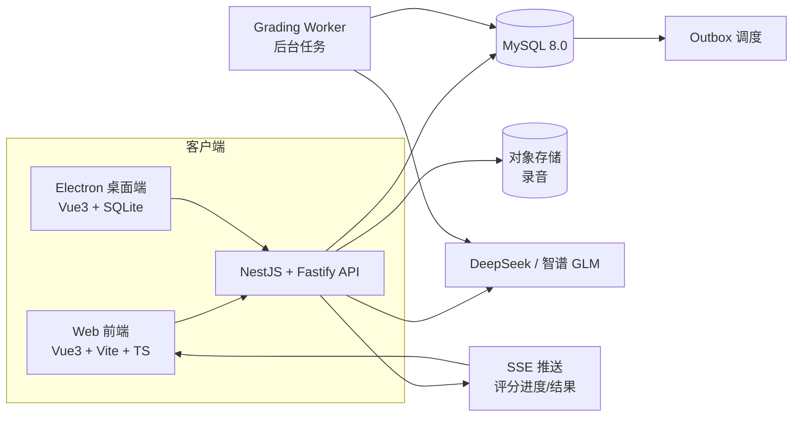

# Tech Design — TOEFL AI 批改平台

| 字段 | 内容 |
|------|------|
| **版本** | v1.0 |
| **日期** | 2026-08-03 |
| **状态** | 建议评审稿（待 watalioy 确认） |
| **前置文档** | `PRD.md`、`docs/database-design-v2.md` |
| **配套文件** | `docs/mysql-schema-v2.sql`、`docs/sqlite-local-schema-v2.sql` |

---

## 1. 技术选型总览

| 层 | 选型 | 说明 |
|----|------|------|
| 前端框架 | Vue 3 + TypeScript | 与现有 Electron 项目技术栈一致，复用能力 |
| 前端构建 | Vite | 快速开发 |
| 前端状态 | Pinia | Vue 官方推荐 |
| 前端路由 | Vue Router | 标准方案 |
| 前端样式 | Tailwind CSS | 大字体、好排版、快速开发 |
| 后端框架 | NestJS + Fastify | 强模块结构 + 高性能 HTTP 引擎 |
| 后端语言 | TypeScript | 全栈统一 |
| ORM / 迁移 | **Prisma**（待确认，备选 TypeORM） | 类型安全 + 成熟迁移工具 |
| 数据库 | 云端 MySQL 8.0 | 结构见 database-design-v2 |
| 认证 | JWT + 会话表（auth_sessions） | v2 已设计 |
| AI 调用 | DeepSeek / 智谱 GLM（OpenAI 兼容接口） | 国内可用、便宜、可随时替换 |
| 消息推送 | **SSE**（第一版即启用，后端单向广播） | 不做轮询，不启用 WebSocket |
| 对象存储 | 阿里云 OSS / 腾讯云 COS（录音） | 第一阶段可先最小额度 |
| 队列 | 第一阶段：数据库 Outbox + Worker | 第二阶段再引入 Redis/Kafka |
| 部署 | 开发期：前端 Vercel + 后端 Railway/Render | 正式期：迁移至国内云服务器 |

---

## 2. 总体架构



---

## 3. 代码仓库结构（Monorepo）

```
toefl-web/                    ← 新仓库，与 toefl-app 分离
├── apps/
│   ├── web/                  ← 前端（Vue 3）
│   │   ├── src/
│   │   │   ├── views/         页面级组件
│   │   │   ├── components/    通用组件
│   │   │   ├── stores/        Pinia
│   │   │   ├── api/           API 客户端封装
│   │   │   ├── router/        路由
│   │   │   └── types/         TS 类型定义
│   │   └── vite.config.ts
│   └── api/                  ← 后端（NestJS + Fastify）
│       └── src/
│           ├── modules/
│           │   ├── auth/          认证模块
│           │   ├── users/         用户模块
│           │   ├── content/       内容/题库模块
│           │   ├── attempts/      作答模块
│           │   ├── grading/       评分模块
│           │   ├── billing/       订单/支付/订阅/额度模块
│           │   └── admin/         后台管理模块
│           ├── common/            公共守卫/管道/拦截器/工具
│           ├── database/          数据库连接/迁移（Prisma）
│           └── main.ts
├── packages/
│   ├── content-core/         ← 共享：Markdown 解析器/校验/客观题判分（复用现有 src/content/）
│   └── ai-grading/           ← 共享：rubrics + prompt 模板 + 评分映射
└── docs/                     ← PRD / database-design / tech-design / AGENTS
```

---

## 4. 模块划分与职责

### 4.1 auth 模块
- 注册 / 登录 / 登出
- 会话管理（auth_sessions）
- 权限守卫（roles / user_roles）

### 4.2 content 模块
- 导入 Markdown → 编译（复用 content-core）→ 登记 document versions
- 建立 task / question 索引
- 提供题目浏览 / 分类 / 搜索 API
- 话题标签（topics，P1）

### 4.3 attempts 模块
- 创建 / 提交 attempt（幂等）
- 客观题服务端判分
- 录音上传（对象存储）
- 历史记录查询

### 4.4 grading 模块
- 创建 grading_job（幂等）
- Grading Worker 消费队列 → 调 AI
- 保存 runs / results / dimension scores
- 重试与失败处理
- 重评（不覆盖旧结果）

### 4.5 billing 模块
- 商品 / 价格 / 权益管理
- 订单创建与支付（支付宝 / 微信）
- 支付 webhook 幂等处理
- 订阅管理
- 额度账户 / 预占 / 流水

### 4.6 admin 模块
- 管理员后台（预留 watalioy 与项目负责人账号）
- 内容发布
- 额度调整（带审计日志）
- 用户管理

---

## 5. 关键数据流

### 5.1 提交主观题（写作 / 口语）→ AI 评分

```
前端 POST /v1/attempts/:id/submit
  → 幂等检查（idempotency_records）
  → 保存 responses + 媒体引用（先存，绝不丢）
  → 检查订阅 / 扣额度（预占）
  → 创建 grading_job（status=queued）
  → 写 outbox: grading.requested
  → attempt 状态 → grading

Grading Worker 领取 job
  → 调 AI API（注入 rubric + prompt）
  → 校验结构化输出
  → 写 grading_result + dimension scores
  → job → succeeded
  → 若按次：预占 → consumed
  → attempt → completed
  → outbox: grading.completed

前端通过 SSE 收到进度/结果推送 → 展示 6 分制 + 反馈 + 润色版
```

### 5.2 支付成功

```
支付宝 / 微信回调 → 验证签名
  → webhook 去重（唯一事件 ID）
  → 更新 payment → order → paid
  → 发放权益（加额度 / 开订阅）
  → 写 outbox: order.paid
  → 记录审计日志
```

---

## 6. 评分展示映射

| 存储 | 展示 |
|------|------|
| raw_score（0-5，ETS rubric） | ❌ 不展示 |
| display_score（6 分制） | ✅ 唯一展示 |
| score_mapping_version | 记录映射规则版本 |

映射规则放在共享包 `ai-grading`，由 rubric_versions 绑定。

各题型处理规则（对齐 PRD）：

| 题型 | 评分 | 分项反馈 | AI 润色版 |
|------|------|---------|----------|
| Write an Email | ✅ | ✅ | ✅ |
| Academic Discussion | ✅ | ✅ | ✅ |
| Take an Interview | ✅ | ✅ | ✅ |
| Listen and Repeat | ✅ | ✅ 发音/连读/口误 | ❌ |

---

## 7. 部署方案

### 阶段 1：开发 / 内测期（国外免费服务）

```
前端  → Vercel（免费）
后端  → Railway 免费额度 / Render 免费层（NestJS）
MySQL → Railway 托管数据库 / Render 免费层
对象存储 → 本地 / 最小额度 OSS
```

> 说明：内测用户需能访问国外服务（需 VPN 或海外网络）。SSE 长连接在国外后端 + 国内访问时可能被中间网络掐断，依赖浏览器自动重连 + 下拉刷新兜底。

### 阶段 2：正式上线（国内服务器）

```
迁移至阿里云 / 腾讯云轻量服务器（¥34/月起）
MySQL → 云数据库（自动备份）
OSS / COS → 正式对象存储
SSE 长连接在国内服务器下更稳定
```

---

## 8. 实施阶段（对齐 database-design-v2 的 A-E）

| 阶段 | 内容 | 交付物 |
|------|------|--------|
| **A** | 本地 SQLite 迁移 + attempt 改造（Electron 端） | 数据不再删库，历史可追溯 |
| **B** | 用户登录 + 内容登记 + attempts 同步 + 历史页面 | 云端只读可用 |
| **C** | AI 异步评分（jobs / worker / results / SSE 推送） | 写作 + 口语评分跑通 |
| **D** | 商业化（商品 / 订单 / 支付 / 额度 / 订阅） | 可收费 |
| **E** | 话题分类 + 搜索优化 + 后台运营 | 内容运营 |

> 原则：先跑通 B + C 核心链路，再上 D 收费。不要先做支付，也不要先把 Markdown 全部关系化。

---

## 9. 与现有 toefl-app 的关系

```
toefl-app（现有 Electron 仓库）：
  ├─ assets/questions/**/*.md   ← 题库源（真值，不动）
  ├─ src/content/parsers/       ← 解析器（抽到 content-core 共享）
  ├─ src/ai/rubrics.js          ← 评分标准（抽到 ai-grading 共享）
  └─ 保持现状，作为"内容源 + 离线端"，阶段 A 修复数据安全

toefl-web（新仓库）：
  ├─ 引用 content-core 编译题库
  ├─ NestJS 后端 + Vue3 前端
  └─ 全部新业务（账号 / 评分 / 支付 / 订阅）
```

---

## 10. 待确认事项

| # | 事项 | 建议 |
|---|------|------|
| 1 | ORM 选型 | **Prisma**（备选 TypeORM） |
| 2 | 后端托管 | Railway 或 Render 均可，建议先 Railway |
| 3 | 前端 UI 风格 | 沿用现有 Electron 的 Apple 风格 |
| 4 | 阶段 A（旧 App 数据修复）负责人 | 建议 watalioy（熟悉 Electron） |
| 5 | Web 端前端 UI 负责人 | 待分工 |
| 6 | 评分结果轮询 vs SSE | 已定 SSE（第一版即启用） |
