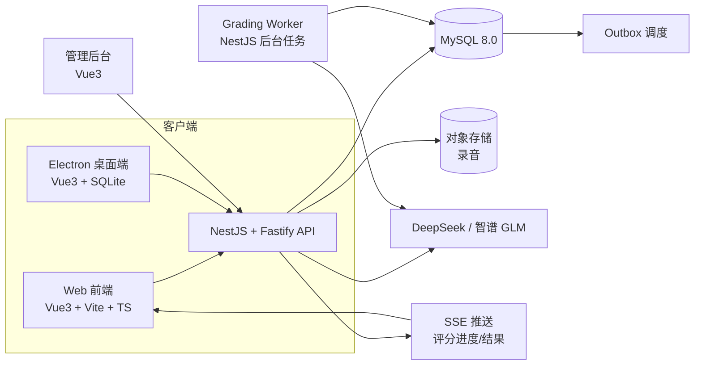
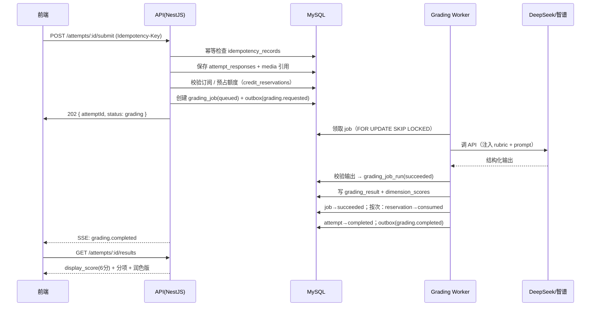
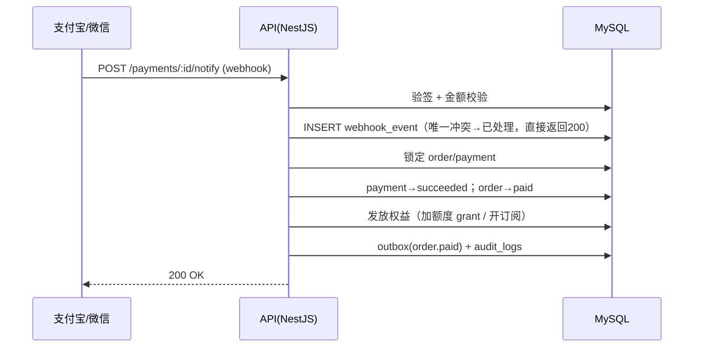

# Tech Design — TOEFL AI 批改平台

| 字段 | 内容 |
|------|------|
| **版本** | v2.0（完整版） |
| **日期** | 2026-08-04 |
| **状态** | 定稿 |
| **前置文档** | `docs/WEB-PRD.md`（PRD）、`docs/database-design-v2.md`（数据层蓝本） |
| **配套文件** | `docs/mysql-schema-v2.sql`、`docs/sqlite-local-schema-v2.sql` |
| **对齐说明** | 本文档以 `database-design-v2.md` 为蓝本，术语、表名、状态机、ID 与时间约定全部沿用 v2，不另起一套。 |

---

## 0. 文档摘要与核心结论

本设计在 `database-design-v2.md` 已定稿的数据模型之上，定义应用层（NestJS + Fastify）、前端层（Vue 3）、接口层、SSE 推送、评分管线、安全监控与交付路径。**数据层的一切以 v2 为准，本文不重复定义数据库结构，只引用。**

### 核心设计结论

1. **数据库是唯一真值，应用层全部围绕 v2 的 6 大域组织**：用户权限域 / 内容题库域 / 练习作答域 / AI 评分域 / 交易额度域 / 可靠消息域。
2. **一切外部副作用必须幂等**：attempt 提交、AI 评分提交、支付下单、支付 webhook、额度预占/消费/释放，全部走 `idempotency_records` + 业务表唯一键双保险。
3. **用户提交内容先落库，再调 AI**：任何情况不丢用户作文与录音。
4. **评分结果可追溯**：raw_score（0-5）→ display_score（6 分制）的映射由 `score_mapping_version` 记录，历史评分永远可解释。
5. **对外只展示 6 分制**；0-5 原始分和 30 分制仅后台保留，绝不暴露。
6. **先跑通 B+C 核心链路，再上 D 收费**；命名改造等阶段 A 稳定后单独分支推进。

---

## 1. 设计范围

### 1.1 本文覆盖

- 应用层技术选型与理由；
- Monorepo 结构与模块划分；
- 完整 REST API 端点清单（路径 / 方法 / 鉴权 / 入参 / 出参）；
- 认证与授权（JWT + auth_sessions + RBAC 守卫）；
- SSE 推送协议（事件类型 / 重连 / 兜底）；
- 关键业务时序（提交评分 / 支付 / 离线同步）；
- 评分管线（rubric → prompt → AI → 校验 → 结果）；
- 统一错误响应格式；
- 安全与隐私；监控与运营指标；测试策略；
- 部署与 CI/CD；实施阶段；验收清单。

### 1.2 本文不重复覆盖

- 数据库表结构细节（见 `database-design-v2.md` 与 `mysql-schema-v2.sql`）；
- 本地 SQLite 结构（见 `sqlite-local-schema-v2.sql`）；
- 产品功能清单（见 `WEB-PRD.md`）。

---

## 2. 现有仓库基础与约束

### 2.1 可复用的现有资产

| 资产 | 位置 | 用途 |
|------|------|------|
| Markdown 题库（真值） | `assets/questions/**/*.md` | 内容源，不动 |
| 内容解析器 / 校验 / 判分 | `content-core/`（已抽取） | 编译 Markdown → 结构化文档；客观题判分 |
| 评分标准 rubrics | `src/ai/rubrics.js` | 四套 ETS 对齐评分标准，导入 `rubric_versions` |
| 本地数据安全（阶段 A） | `feat/phase-a-data-safety`（已验收） | SQLite 迁移 / attempt 固化 / 录音绑定 |

### 2.2 硬性约束（沿用 v2）

- MySQL 是云端真值；Markdown 是内容真值；两者不互相复制正文。
- 不可变历史：已提交的 attempt / grading_result / credit_ledger 绝不原地修改。
- 禁止物理删除财务、评分、审计数据。
- 状态跳转由领域服务控制，禁止任意 SQL 更新。
- 内外部 ID 分离：内部 BIGINT，对外 ULID，内容哈希 SHA-256。

---

## 3. 设计目标与原则

### 3.1 目标

1. **可维护**：每个 NestJS 模块只表达一个稳定的业务域（对齐 v2 的域划分）。
2. **可追溯**：任何分数都能回答"基于哪版题目、rubric、prompt、模型、映射规则"。
3. **可恢复**：网络 / AI / 支付回调 / worker 中断后安全重试。
4. **可审计**：额度、支付、退款、管理员修改全留痕。
5. **离线优先**：Electron 断网可作答，联网幂等同步。
6. **渐进演进**：阶段 A-E 分批落地，不一次建全 33 张表。

### 3.2 应用层原则（在 v2 数据层原则之上补充）

- **原则 E：接口契约先行**。每个 API 的出参结构用 TypeScript 类型 + zod schema 双重声明，前端类型由 `packages/api-client` 共享生成。
- **原则 F：SSE 只做通知渠道，不做数据通道**。评分结果永远可轮询/刷新获取，SSE 断线不影响功能。
- **原则 G：供应商可替换**。AI 调用全部走统一抽象，供应商（DeepSeek/智谱/未来其他）只在配置层切换。
- **原则 H：先功能后规模**。第一阶段不引入 Redis/Kafka，用数据库 Outbox + 定时 Worker；性能瓶颈出现后再迁移。

---

## 4. 技术约定

### 4.1 与 v2 完全一致的约定

| 约定 | 规范 |
|------|------|
| ID | 内部 `BIGINT UNSIGNED`；API/URL 用 `CHAR(26)` ULID；内容哈希 `CHAR(64)` SHA-256 |
| 时间 | 全部 UTC `DATETIME(3)`；前端展示时转换用户时区 |
| 金额 | 最小货币单位整数（`amount_minor`），禁止浮点数 |
| 币种 | ISO 4217 三位码（`CNY`） |
| 状态字段 | `VARCHAR + CHECK`，由领域服务控制跳转 |
| 删除策略 | 财务/评分/审计禁删；外键默认 RESTRICT |
| 字符集 | utf8mb4 / utf8mb4_0900_ai_ci，InnoDB |

### 4.2 应用层新增约定

| 约定 | 规范 |
|------|------|
| REST 前缀 | `/v1/...` |
| 幂等键 | 写操作必带 `Idempotency-Key` 头（ULID）；服务端写入 `idempotency_records` |
| 错误码 | `DOMAIN:CODE` 格式，如 `ATTEMPT:NOT_FOUND`、`CREDIT:INSUFFICIENT`、`GRADING:PROVIDER_FAILED` |
| 统一响应 | 成功 `{ data }`；失败 `{ error: { code, message, requestId, details? } }` |
| 分页 | `?cursor=`（游标）或 `?page=&limit=`（偏移），列表接口统一返回 `{ items, nextCursor }` |
| 日志 | 结构化 JSON；禁止记录完整作文/录音/token/密码/支付密钥 |
| 敏感字段 | 全部走服务端 secret manager / 环境变量，前端不可见 |

---

## 5. 总体架构



### 5.1 真值与投影（沿用 v2 第 5.1 节）

| 数据 | 真值 | 投影 / 缓存 |
|------|------|------------|
| 题目源码 | Git Markdown | 无 |
| 运行时题目 | 不可变 compiled document / pack | 客户端本地安装内容 |
| 内容检索 | compiled document 可重建 | MySQL `content_tasks / content_questions` |
| 作答草稿 | 用户设备本地 session | Pinia 状态 |
| 正式提交 | 云端 `attempts / attempt_responses` | 本地已同步缓存 |
| AI 结果 | `grading_results` | 报告页面缓存 |
| 次数余额 | `credit_ledger` 可重放，`credit_accounts` 事务余额 | 前端显示余额 |
| 支付状态 | 支付平台 + `payments / webhook_events` | 订单页面 |

---

## 6. Monorepo 结构

```
toefl-web/                     ← 新仓库，与 toefl-app 分离
├── apps/
│   ├── web/                   ← Web 前端（Vue 3）
│   │   ├── src/
│   │   │   ├── views/          页面（Home/Exam/Results/History/Pricing/Admin）
│   │   │   ├── components/     通用组件
│   │   │   ├── stores/         Pinia（auth/catalog/attempt/credits）
│   │   │   ├── api/            基于 packages/api-client
│   │   │   ├── router/         Vue Router 路由
│   │   │   └── types/          TS 类型
│   │   └── vite.config.ts
│   └── api/                    ← 后端（NestJS + Fastify）
│       └── src/
│           ├── modules/
│           │   ├── auth/          认证模块
│           │   ├── users/         用户模块
│           │   ├── content/       内容/题库模块
│           │   ├── attempts/      作答模块
│           │   ├── grading/       评分模块 + worker
│           │   ├── billing/       订单/支付/订阅/额度模块
│           │   ├── admin/         后台管理模块
│           │   └── notifications/ SSE 推送模块
│           ├── common/            守卫/管道/拦截器/错误/日志/幂等
│           ├── database/          Prisma 连接与迁移
│           └── main.ts
│   └── admin/                   ← 管理后台（Vue 3，独立 app，共享组件库）
├── packages/
│   ├── content-core/            ← 共享：解析/校验/客观题判分（从 toefl-app 抽取）
│   ├── ai-grading/              ← 共享：rubrics + prompt + 评分映射（含 score_mapping）
│   └── api-client/              ← 共享：API 请求封装 + TS 类型 + zod schema
├── prisma/                      ← Prisma schema 与迁移文件（映射 v2 DDL）
└── docs/                        ← WEB-PRD / database-design-v2 / tech-design / AGENTS
```

**Prisma 与 v2 DDL 的关系**：`prisma/schema.prisma` 由 `mysql-schema-v2.sql` 派生，作为 ORM 层映射；DDL 仍是数据库层的权威真值，二者必须保持一致，任何结构变更双端同步。

---

## 7. API 设计（完整端点清单）

> 所有写操作需 `Idempotency-Key`。认证方式：`Authorization: Bearer <jwt>`（除公开端点）。对外 ID 一律用 ULID。

### 7.1 auth 模块

| 方法 | 路径 | 鉴权 | 说明 |
|------|------|------|------|
| POST | /v1/auth/register | 公开 | 邮箱+密码注册；创建 users + user_identities(provider=password) + credit_accounts |
| POST | /v1/auth/login | 公开 | 校验密码 → 创建 auth_sessions → 返回 access+refresh token |
| POST | /v1/auth/refresh | 公开(refresh token) | 刷新会话 |
| POST | /v1/auth/logout | 用户 | 撤销当前 auth_session |
| GET | /v1/auth/me | 用户 | 当前用户信息 + 额度 + 有效订阅 |
| POST | /v1/auth/password/reset | 公开 | 忘记密码（P1） |

### 7.2 users 模块

| 方法 | 路径 | 鉴权 | 说明 |
|------|------|------|------|
| GET | /v1/users/me/credits | 用户 | 额度账户概览（available/reserved） |
| GET | /v1/users/me/credit-ledger | 用户 | 额度流水（分页） |
| GET | /v1/users/me/subscriptions | 用户 | 当前订阅 |
| PATCH | /v1/users/me/profile | 用户 | 改昵称等（非敏感） |

### 7.3 content 模块

| 方法 | 路径 | 鉴权 | 说明 |
|------|------|------|------|
| GET | /v1/content/tests | 用户 | 套题列表（分组：分科/套题/话题） |
| GET | /v1/content/tests/:testId | 用户 | 单套详情（含各 section 状态） |
| GET | /v1/content/documents/:documentVersionId | 用户 | 题目文档内容（compiled JSON） |
| GET | /v1/content/tasks | 用户 | 任务列表，支持 section/type/topic/title/subtitle 筛选 |
| GET | /v1/content/tasks/:taskId | 用户 | 任务详情（含题目） |
| GET | /v1/content/search | 用户 | 全文搜索（title/subtitle/search_text，可跨 TPO） |
| GET | /v1/content/topics | 用户 | 话题分类树（P1） |
| GET | /v1/content/releases | 用户 | 当前激活内容版本信息 |

### 7.4 attempts 模块

| 方法 | 路径 | 鉴权 | 说明 |
|------|------|------|------|
| POST | /v1/attempts | 用户 | 创建 attempt（幂等：client_attempt_id） |
| PUT | /v1/attempts/:clientAttemptId/draft | 用户 | 保存草稿（lock_version 乐观锁） |
| PUT | /v1/attempts/:clientAttemptId/responses | 用户 | 逐题保存响应（幂等） |
| POST | /v1/attempts/:clientAttemptId/submit | 用户 | 正式提交（Idempotency-Key）→ 客观题判分 → 主观题建 grading_job |
| GET | /v1/attempts/:clientAttemptId | 用户 | attempt 详情（含响应与状态） |
| GET | /v1/attempts | 用户 | 历史记录（分页，user_id + started_at DESC） |
| GET | /v1/attempts/:clientAttemptId/results | 用户 | 评分结果报告（display_score + 分项 + 润色版） |
| POST | /v1/media/presign | 用户 | 录音上传预签名 URL（幂等） |
| POST | /v1/media/complete | 用户 | 录音上传完成确认（写 media_objects） |

### 7.5 grading 模块

| 方法 | 路径 | 鉴权 | 说明 |
|------|------|------|------|
| POST | /v1/attempts/:clientAttemptId/re-grade | 用户 | 对已提交响应重新评分（创建新 grading_job） |
| GET | /v1/grading/jobs/:jobPublicId | 用户 | 评分任务状态（供 SSE 断线后查询） |
| GET | /v1/grading/results/:resultPublicId | 用户 | 评分结果详情 |
| GET | /v1/attempts/:clientAttemptId/events | 用户 | SSE 订阅评分进度事件 |

### 7.6 billing 模块

| 方法 | 路径 | 鉴权 | 说明 |
|------|------|------|------|
| GET | /v1/billing/products | 公开 | 商品+价格+权益列表 |
| POST | /v1/billing/orders | 用户 | 创建订单（幂等）→ 返回支付参数 |
| GET | /v1/billing/orders/:orderId | 用户 | 订单详情 |
| POST | /v1/billing/payments/:paymentId/notify | 公开(验签) | 支付平台 webhook（幂等去重） |
| GET | /v1/billing/orders | 用户 | 订单历史（分页） |
| POST | /v1/billing/subscriptions/:subId/cancel | 用户 | 取消续订（cancel_at_period_end） |
| POST | /v1/billing/refunds | admin | 退款（P1，带审计） |

### 7.7 admin 模块

| 方法 | 路径 | 鉴权 | 说明 |
|------|------|------|------|
| POST | /v1/admin/content/release | admin/content_editor | 发布内容 release（关联 git commit） |
| GET | /v1/admin/content/releases | admin | release 列表/状态 |
| PATCH | /v1/admin/users/:userId/status | admin | 禁用/启用用户（写 audit_logs） |
| POST | /v1/admin/users/:userId/credits/adjust | admin/finance | 额度调整（写 credit_ledger + audit_logs） |
| GET | /v1/admin/metrics | admin | 运营指标（对齐第 14 节） |
| GET | /v1/admin/audit-logs | admin | 审计日志查询 |

---

## 8. 认证与授权设计

### 8.1 认证流程（JWT + auth_sessions）

```
注册: POST /auth/register
  → 创建 users（email_normalized 唯一）
  → 创建 user_identities（provider=password, password_hash=argon2id/bcrypt）
  → 创建 credit_accounts（available=0）

登录: POST /auth/login
  → 校验密码
  → 创建 auth_sessions（token_hash + refresh_token_hash 存哈希，明文只在响应返回）
  → 返回 access token（短期）+ refresh token（长期）

请求鉴权:
  Authorization: Bearer <access>
  → JwtAuthGuard 校验签名与过期
  → 从 token 中取 session public_id → 查 auth_sessions 确认未撤销
  → 附加当前用户上下文
```

### 8.2 角色与权限（RBAC）

第一阶段角色（写入 roles 表）：

```text
user
content_editor
support
finance
admin
super_admin
```

守卫方案：`RolesGuard`（对齐 `roles / user_roles`）+ `JwtAuthGuard`，组合装饰器：

```typescript
@Roles('admin')
@UseGuards(JwtAuthGuard, RolesGuard)
```

所有后台写操作必须写 `audit_logs`（actor / action / target / before / after / request_id）。

### 8.3 密码与会话安全

- 密码：Argon2id 或 bcrypt，绝不存明文；
- 修改密码后批量撤销该用户全部 auth_sessions；
- token 明文不落库，只存 SHA-256 哈希。

---

## 9. SSE 推送协议设计

### 9.1 设计原则

- SSE **只推送通知**，不承载数据；数据始终可从 REST 重新获取。
- 第一版即启用，不做轮询、不启用 WebSocket。
- 断线自动重连（浏览器原生 EventSource）+ 下拉刷新兜底。

### 9.2 端点

```
GET /v1/attempts/:clientAttemptId/events
Accept: text/event-stream
Authorization: Bearer <jwt>
```

### 9.3 事件类型

| event | data | 说明 |
|-------|------|------|
| `grading.pending` | `{ attemptId, status }` | 已排队 |
| `grading.processing` | `{ attemptId }` | AI 批改中 |
| `grading.retry` | `{ attemptId, retryCount }` | 重试中 |
| `grading.completed` | `{ attemptId, resultId }` | 完成，前端据此拉取结果 |
| `grading.failed` | `{ attemptId, retryable }` | 失败（可重试/已退回次数） |
| `ping` | `{ ts }` | 心跳，每 30s，防中间层掐断 |

### 9.4 断线与兜底

```
EventSource 断线 → 浏览器自动重连（retry 字段/EventSource 内置）
  → 重连后服务端回放最近一次状态快照

前端兜底：
  - "刷新状态"按钮 → GET /v1/grading/jobs/:id
  - 结果页下拉刷新 → GET /v1/attempts/:id/results
  - 任何情况下结果不丢（数据在 MySQL）
```

---

## 10. 关键业务时序

### 10.1 提交主观题（写作/口语）→ AI 评分



### 10.2 支付成功



### 10.3 离线同步（Electron → 云端）

```
客户端断网作答
  → 本地 pending_attempts(status=pending-upload)
  → 联网后按 sync_queue 顺序上传
  → POST /v1/attempts（client_attempt_id 幂等）
  → 成功 → pending_attempts→synced；失败 → 重试退避
```

---

## 11. 评分管线设计

### 11.1 分层（对齐 v2 第 10 节）

```text
attempt_response
  → grading_job（一次逻辑评分）
  → grading_job_runs（每次实际 AI 调用，可多次=重试）
  → grading_results（不可变结果）
  → grading_dimension_scores（各维度分数）
```

### 11.2 prompt 组装（packages/ai-grading）

```
prompt = prompt_template(rubric_version) + 任务原文(task) + 用户回答(response)
       + 输出 schema 约束（output_schema_json）

rubric_versions 表绑定：rubric_code + version + prompt_template + output_schema_json + checksum
```

### 11.3 输出校验

- AI 返回必须通过 `output_schema_json` 对应的 zod schema 校验；
- 校验失败 → 该 run 记为 failed，走重试；
- 解析成功 → 写 grading_results（raw_score + display_score + feedback_json + polished_text）。

### 11.4 分数映射（score_mapping_version）

| 内部字段 | 值 | 展示 |
|---------|-----|------|
| raw_score | 0-5（ETS 对齐） | ❌ |
| display_score | 0-6（映射后） | ✅ 唯一展示 |

映射规则版本化（`score_mapping_version`），未来调整映射不影响历史记录解释。

### 11.5 各题型评分与润色规则（对齐 PRD）

| 题型 | 评分 | 分项反馈 | AI 润色版 |
|------|------|---------|----------|
| Write an Email | ✅ | ✅ | ✅ |
| Academic Discussion | ✅ | ✅ | ✅ |
| Take an Interview | ✅ | ✅ | ✅ |
| Listen and Repeat | ✅ | ✅ 发音/连读/口误 | ❌ |

---

## 12. 错误处理与统一响应格式

### 12.1 响应结构

```json
// 成功
{ "data": { } }

// 失败
{
  "error": {
    "code": "CREDIT:INSUFFICIENT",
    "message": "余额不足，请先购买次数或开通会员",
    "requestId": "req_01HX...",
    "details": { }
  }
}
```

### 12.2 错误码规范（`DOMAIN:CODE`）

| 域 | 示例 |
|----|------|
| AUTH | `AUTH:INVALID_CREDENTIALS`、`AUTH:TOKEN_EXPIRED`、`AUTH:ACCOUNT_DISABLED` |
| USER | `USER:NOT_FOUND` |
| CONTENT | `CONTENT:NOT_FOUND`、`CONTENT:RELEASE_UNVERIFIED` |
| ATTEMPT | `ATTEMPT:NOT_FOUND`、`ATTEMPT:ALREADY_SUBMITTED`、`ATTEMPT:NOT_OWNER` |
| GRADING | `GRADING:PROVIDER_FAILED`、`GRADING:OUTPUT_INVALID`、`GRADING:RETRY_EXHAUSTED` |
| CREDIT | `CREDIT:INSUFFICIENT`、`CREDIT:RESERVATION_EXPIRED` |
| BILLING | `BILLING:ORDER_EXPIRED`、`BILLING:WEBHOOK_SIGNATURE`、`BILLING:IDEMPOTENCY_CONFLICT` |
| IDEMPOTENCY | `IDEMPOTENCY:KEY_REUSED_WITH_DIFFERENT_REQUEST` |

### 12.3 全局错误处理

- 统一 `ExceptionFilter`：捕获业务异常 → 映射错误码；未知异常 → 500 + 记录日志；
- 幂等冲突（同一 key 不同 request hash）→ 409，而非复用旧结果；
- 所有异常响应带 `requestId`，便于日志关联。

---

## 13. 安全与隐私（对齐 v2 第 18 节）

| 项 | 措施 |
|----|------|
| 密码 | Argon2id / bcrypt，只存哈希 |
| Token | 只存哈希（auth_sessions.token_hash） |
| API Key | 仅服务端 secret manager，前端不可见 |
| AI Key | DeepSeek/智谱 key 只存服务端环境变量 |
| 用户内容 | 作文/录音访问必须鉴权；私有 bucket + 短期签名 URL |
| 支付 | webhook 验签；payload 入库前脱敏 |
| 日志 | 禁止记录完整作文/录音/token/密码/支付密钥 |
| 用户删除 | 状态标记 deleted + 匿名化，财务记录保留法定字段 |

---

## 14. 监控与运营指标（对齐 v2 第 24 节）

### 14.1 必监控项

| 指标 | 监控点 |
|------|--------|
| grading 队列 | 队列长度、最老任务等待时间 |
| AI | 各模型 token、成本、P95 latency、retry/terminal failure 比例 |
| 支付 | webhook 失败与积压 |
| 额度 | credit_ledger 对账差异（periodic check：ledger 末条 = account 余额） |
| Outbox | 未发布数量 |
| 同步 | attempt 同步失败与冲突 |
| 内容 | release 客户端激活比例 |
| 数据库 | 慢查询、连接池、锁等待、容量 |

### 14.2 对账机制

```
credit_ledger 最后一条 available_after / reserved_after
= credit_accounts 当前余额
不一致 → 报警，禁止自动静默修正
```

---

## 15. 测试策略

| 层 | 工具 | 覆盖 |
|----|------|------|
| 单元 | Vitest | 评分映射、rubric 解析、错误码映射、prompt 组装 |
| 接口 | Jest + Supertest | 每个 REST 端点的状态码/入参/出参/鉴权 |
| 数据库 | 真实 MySQL + Prisma migrate reset | 迁移可执行、回填幂等 |
| 并发 | 模拟并发提交 | 额度并发只有允许数量成功；同一 client_attempt_id 只创建一次 |
| 重放 | webhook 重复推送 | 不重复发放权益；幂等键复用返回旧结果 |
| 评分 | mock AI provider | 输出校验、重试、失败释放预占 |
| 前端 | Vitest + Vue Test Utils | 组件渲染、SSE 事件处理、断线兜底 |

关键路径必须有测试：注册/登录/提交/评分/支付/额度。

---

## 16. 部署与 CI/CD

### 16.1 开发 / 内测期（国外免费服务）

```
前端    → Vercel（免费）
后端    → Railway 免费额度 或 Render 免费层（NestJS + Fastify）
MySQL   → Railway 托管 / Render 托管
对象存储 → 本地或最小额度 OSS
```

> 说明：内测用户需能访问国外服务（VPN/海外网络）。SSE 长连接在国外后端 + 国内访问可能被中间网络掐断，依赖自动重连 + 刷新兜底。

### 16.2 正式上线（国内服务器）

```
迁移至阿里云 / 腾讯云轻量服务器（¥34/月起）
MySQL → 云数据库（自动备份 + PITR）
OSS / COS → 正式对象存储
SSE 长连接在国内服务器下更稳定
```

### 16.3 CI/CD 流程

```
git push → GitHub Actions
  ├─ lint + test（单元/接口/数据库迁移）
  ├─ build（前端 + 后端）
  ├─ 部署前端 → Vercel
  ├─ 部署后端 → Railway/Render
  └─ migration 自动执行（有回滚点）
```

### 16.4 环境变量清单

```
DATABASE_URL
JWT_ACCESS_SECRET / JWT_REFRESH_SECRET
AI_PROVIDER / AI_API_KEY / AI_MODEL
STORAGE_PROVIDER / STORAGE_BUCKET / STORAGE_ACCESS_KEY / STORAGE_SECRET
ALIPAY_* / WECHAT_*（支付配置）
CLIENT_ORIGIN（CORS）
```

---

## 17. 实施阶段（对齐 database-design-v2 第 22 节）

| 阶段 | 内容 | 交付物 | 状态 |
|------|------|--------|------|
| **A** | 本地 SQLite 迁移 + attempt 改造（Electron 端） | 数据不再删库，历史可追溯 | ✅ 已验收 |
| **B** | 用户登录 + 内容登记 + attempts 同步 + 历史页面 | 云端只读可用 | 待启动 |
| **C** | AI 异步评分（jobs/worker/results/SSE） | 写作+口语评分跑通 | 待启动 |
| **D** | 商业化（商品/订单/支付/额度/订阅） | 可收费 | 待启动 |
| **E** | 话题分类 + 搜索优化 + 后台运营 | 内容运营 | 待启动 |

> 原则：先 B+C 跑通"提交→评分→展示"，再 D 收费。命名改造（双轨命名）在阶段 A 稳定后单独分支推进。

---

## 18. 验收清单

### 认证与用户
- [ ] 注册/登录/刷新/登出全流程可用
- [ ] 密码与 token 只存哈希
- [ ] 角色守卫生效，越权返回 403

### 内容
- [ ] Markdown 不变时不重复创建 document version
- [ ] source hash 变化产生新 version
- [ ] 搜索索引可从 compiled content 全量重建

### 作答
- [ ] 同一 client_attempt_id 重传只创建一次
- [ ] 一套题可保存无限次 attempt
- [ ] 旧 attempt 不因内容更新改变题目
- [ ] 提交后 response 不可编辑
- [ ] 断网录音恢复后可继续上传

### AI 评分
- [ ] 用户原文/录音引用在 AI 调用前已提交
- [ ] 同一幂等键只创建一个 job
- [ ] 自动重试不重复扣费
- [ ] 永久失败释放预占次数
- [ ] 结果可追踪 rubric/prompt/model/mapping version
- [ ] 重评创建新 job，不覆盖旧结果
- [ ] SSE 完成事件后可从 REST 拉取结果（断线兜底）

### 支付与额度
- [ ] 重复 webhook 不重复发放权益
- [ ] 金额币种与支付平台一致
- [ ] 订单/payment/权益在一个事务内落地
- [ ] 额度不足时并发提交只有允许数量成功
- [ ] ledger 可重放出当前余额
- [ ] 退款产生冲正记录，不修改旧流水

### 运维
- [ ] 所有 schema 变更通过 migration
- [ ] SQLite 升级不删除用户数据
- [ ] 备份可实际恢复
- [ ] 管理员高风险操作有 audit log
- [ ] Outbox 失败可重试

---

## 19. 待定事项（开发时确定）

| # | 事项 | 当前倾向 |
|---|------|---------|
| 1 | 开发期后端托管 | Railway 或 Render 皆可，开发时选定 |
| 2 | Web 前端 UI 负责人 | 待分工 |
| 3 | 前端 UI 风格 | 沿用现有 Electron Apple 风格 |
| 4 | Redis 引入时机 | 用户量上来后评估，第一版用数据库 Outbox |
| 5 | 支付渠道首选 | 支付宝 / 微信，接入时按个人资质选定 |
| 6 | 域名与备案 | 正式上线国内服务器时处理 |
